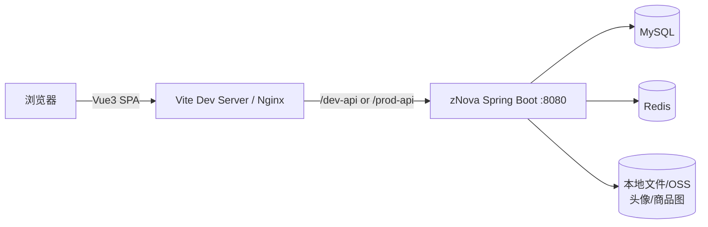
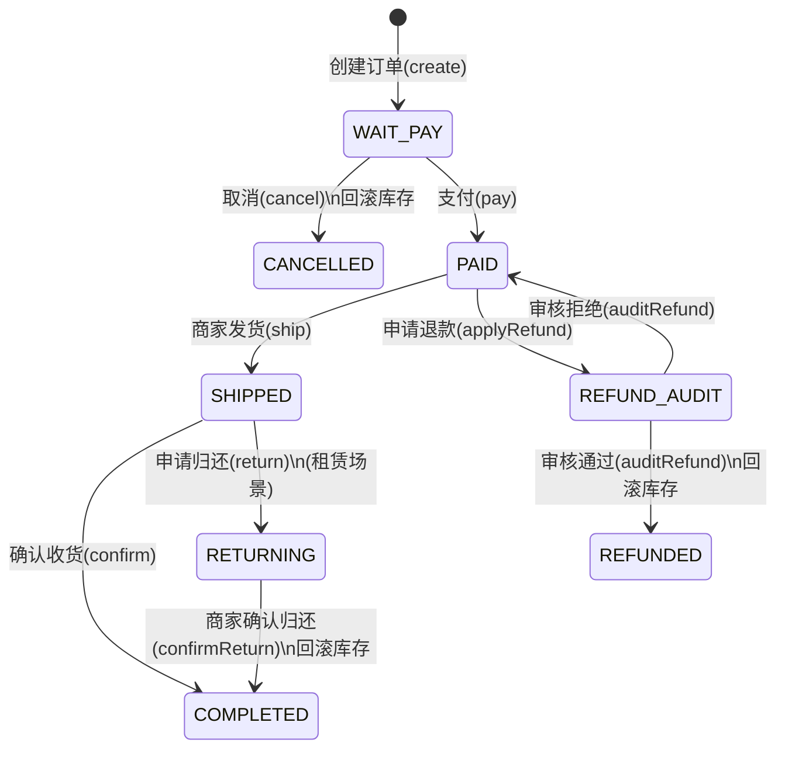

# 新星电脑租赁与硬件性能智能评估平台（zNova）

> 目标：让「只能读取 README」的读者/AI 也能理解项目是什么、怎么跑起来、有哪些模块/页面/接口、业务流程如何串起来、数据结构大概是什么样子。

本仓库是一个 **前后端一体** 的毕业设计/课程设计型项目：在 RuoYi-Vue3 的后台管理能力基础上，扩展出 **C 端电脑租赁/购买商城** 与 **DIY 装机性能评估**，并补齐了 **订单/购物车/地址/评价/商家订单履约** 等电商闭环能力。

---

## 目录

- [项目概览](#overview)
- [角色与入口](#roles)
- [技术栈](#stack)
- [仓库结构与关键文件导航](#structure)
- [核心业务规则](#biz)
- [前端工程详解（Vue3/Vite）](#frontend)
- [后端工程详解（Spring Boot 多模块）](#backend)
- [API 设计与接口清单](#api)
- [数据库与核心表（从代码反推）](#db)
- [性能评估算法说明](#perf)
- [本地运行（开发环境）](#dev)
- [构建与部署（生产环境）](#deploy)
- [配置说明（前端 env + 后端 yml）](#config)
- [二次开发指南（给维护者/AI 的“落点”）](#guide)
- [常见问题与排错](#faq)
- [安全提示](#security)
- [License](#license)

---

<a id="overview"></a>
## 项目概览

### 你能用它做什么

- C 端（用户侧）
  - 浏览电脑商品：租赁/出售两类，支持筛选、排序、查看详情
  - 购物车：加入/修改数量/勾选/删除
  - 下单与结算：选择地址、租赁日期、备注、提交订单
  - 支付（演示）：模拟支付成功，推动订单状态流转
  - 订单中心：查看订单、取消订单、申请退款、确认收货/归还
  - 地址管理：新增/编辑/删除/设置默认
  - 商品评价：查看评价列表、订单完成后发表评价
  - DIY 装机评估：选择 CPU/GPU/内存后评估总分 + 典型游戏帧率（1080P/2K/4K）
  - 装机单：登录后可保存/修改/删除个人装机配置

- 管理端 / 商家端（后台）
  - 权限/菜单/用户/角色/部门/字典/日志等（RuoYi 原生能力）
  - 商品管理：维护商品（租赁/出售/租售一体）、库存、关联商家（deptId 数据隔离）
  - 订单管理（商家维度）：发货、确认归还、退款审核、修改收货信息等
  - 硬件基础数据维护：CPU/GPU/内存/主板/电源等
  - 商家仪表盘：今日订单、待发货、租赁中、商品总数、近 7 日趋势
  - 游戏基准数据维护：用于装机帧率评估的基准数据

### 架构概览（读图即可理解）



---

<a id="roles"></a>
## 角色与入口

### 角色划分

- **后台管理员**：拥有系统管理权限，可查看全量数据、维护基础数据、管理商品、审核退款等。
- **商家账号（部门维度）**：同样走后台登录，但数据通过 `deptId + DataScope` 做隔离，只能看本店商品/订单。
- **C 端用户**：独立登录体系（`/app/login`），Token 存在 `localStorage(app_token)`，用于商城/下单/个人中心等。

### 本地访问入口（默认）

> 前端开发服务器默认端口为 `80`（可改），后端默认端口为 `8080`。

- 后台管理端登录页：`http://localhost:80/login`
- C 端商城首页：`http://localhost:80/computer-market`
- C 端登录/注册：
  - `http://localhost:80/portal/login`
  - `http://localhost:80/portal/register`

### 默认账号（示例/开发环境）

- 后台：admin / admin123
- C 端：支持注册后登录（`/portal/register`）

> 生产环境务必自行修改默认密码，并关闭不必要的调试日志。

---

<a id="stack"></a>
## 技术栈

### 前端

- Vue 3（Composition API）
- Vite 5
- Element Plus
- Pinia（状态管理）
- Vue Router
- Axios
- ECharts（后台仪表盘）

### 后端

- Spring Boot 2.5.15（Java 8）
- MyBatis（xml mapper）
- Druid 数据源
- Spring Security（RuoYi 风格鉴权）
- Redis
- Swagger（springfox 3）
- cn.xuyanwu file-storage（头像/文件存储，支持 OSS）

---

<a id="structure"></a>
## 仓库结构与关键文件导航

> 只看这节，你就能知道“在哪儿改什么”。

### 前端（`src/`）

- `src/main.js`：入口，注册全局组件/工具方法
- `src/router/index.js`：路由（后台/前台/portal 混合在同一套路由里）
- `src/permission.js`：路由守卫（后台需要 Admin Token；`/computer-market` 和 `/portal` 放行）
- `src/utils/request.js`：Axios 封装（区分后台 token 与 C 端 token）
- `src/utils/auth.js`：token 存储（后台 token in cookie；C 端 token in localStorage）
- `src/api/`：接口封装（按业务域拆分）
  - `src/api/login.js`：后台登录 `/login`
  - `src/api/menu.js`：动态路由 `/getRouters`
  - `src/api/appLogin.js`：C 端登录/注册/用户信息 `/app/**`
  - `src/api/front/`：前台商品/硬件/性能评估/装机单 `/front/**`
  - `src/api/shop/cart.js`：购物车 `/app/cart/**`
  - `src/api/portal/`：C 端地址/订单/用户 `/app/**`
  - `src/api/merchant/dashboard.js`：商家仪表盘 `/merchant/dashboard/**`
  - `src/api/system/`：后台业务模块 `/system/**`
- `src/views/`：页面
  - `src/views/computerMarket/`：C 端商城
  - `src/views/portal/`：C 端登录注册 + 用户中心 + 结算/支付
  - `src/views/system/`：后台业务模块
  - `src/views/dashboard/`：后台首页（管理员/商家）

### 后端（`zNova/`）

> `zNova` 是 Spring Boot 多模块 Maven 工程。

- `zNova/zNova-admin`：启动入口（`com.zNova.zNovaApplication`），聚合 web/controller
- `zNova/zNova-framework`：框架层（安全、拦截器、通用配置等）
- `zNova/zNova-system`：系统基础模块（用户/角色/菜单/字典等 RuoYi 标准表）
- `zNova/zNova-merchant`：本项目业务核心模块（商品、订单、购物车、C 端用户、硬件、性能评估、商家仪表盘等）
- `zNova/zNova-quartz`：定时任务模块
- `zNova/zNova-generator`：代码生成模块
- `zNova/zNova-common`：通用工具/实体/常量

---

<a id="biz"></a>
## 核心业务规则

### 商品类型与业务类型

- 商品（`biz_product.product_type`）
  - `1`：租赁
  - `2`：出售
  - `3`：租售一体（同一商品既可租也可买）
- 订单项/购物车业务类型（`businessType`）
  - `1`：租赁
  - `2`：购买

### 多商家拆单（一个 create 可能返回多个 orderNo）

在 `zNova/zNova-merchant/src/main/java/com/zNova/system/controller/AppOrderController.java` 的 `create` 方法中：

- 创建订单时会把 `items` 按商品的 `deptId(商家/部门)` 分组
- 同一次提交如果买了多个商家的商品，会拆成多个子订单
- 接口返回的是 `orderNos: string[]`
- 后续支付/发货/归还/退款等以 `orderNo` 或 `orderId` 为操作对象

### 订单状态（后端常量）

来自 `zNova/zNova-merchant/src/main/java/com/zNova/system/service/impl/ShopOrderServiceImpl.java`：

- `0`：待支付（WAIT_PAY）
- `1`：已支付/待发货（PAID）
- `2`：已发货/租赁中（SHIPPED）
- `3`：已完成（COMPLETED）
- `4`：已取消（CANCELLED）
- `5`：退款审核中（REFUND_AUDIT）
- `6`：已退款（REFUNDED）
- `7`：归还中（RETURNING）

### 订单状态流转（状态机）



> 注意：当前实现是“创建订单即扣库存”。如果用户创建后不支付，库存会一直被占用，直到用户取消/管理员处理（可考虑后续用定时任务超时关闭订单）。

### 价格计算与库存规则（创建订单时）

- 购买（`businessType=2`）：`total = salePrice * quantity`
- 租赁（`businessType=1`）：`total = rentPrice * rentDays * quantity`（`rentDays` 由 `startDate/endDate` 计算）
- 扣库存：`ShopOrderServiceImpl#insertShopOrder` 中对每个 `ShopOrderItem` 执行 `bizProductMapper.decreaseStock(productId, quantity)`（SQL 原子更新）
- 回滚库存：
  - 用户取消（`status 0 -> 4`）会回滚库存
  - 退款审核通过（`status 5 -> 6`）会回滚库存
  - 商家确认归还（`status 7 -> 3`）会回滚库存

---

<a id="frontend"></a>
## 前端工程详解（Vue3/Vite）

### 路由与鉴权（非常关键）

- 路由守卫：`src/permission.js`
  - 访问 `/computer-market/**`：直接放行（不校验后台 token）
  - 访问 `/portal/**`：直接放行（但页面内会校验 `app_token`，没登录会跳转到 `/portal/login`）
  - 其他（后台）页面：需要 `Admin-Token`（cookie）才能访问

### 双 Token 机制（后台 & C 端）

Axios 封装在 `src/utils/request.js`，核心规则：

- 请求 URL 以 `/app/` 或 `/front/` 开头：视为 **C 端接口**
  - Token 存储在 `localStorage(app_token)`
  - Header：`Authorization: Bearer <app_token>`
- 其他请求：视为 **后台接口**
  - Token 存储在 cookie `Admin-Token`
  - Header：`Authorization: Bearer <Admin-Token>`

> 这也是为什么前端把 “C 端接口” 与 “后台接口” 分成 `/app/**`、`/front/**`、`/system/**`、`/merchant/**` 等不同前缀。

### 图片地址处理（本地/OSS 兼容）

`src/utils/ruoyi.js` 中的 `handleImageUrl(url)` 规则：

- `url` 以 `http(s)://` 开头：认为是 OSS/公网地址，直接返回
- 否则：按本地相对路径处理，拼接 `import.meta.env.VITE_APP_BASE_API + url`

### C 端页面与路由（主链路）

| 路由 | 页面文件 | 功能概述 |
|---|---|---|
| `/computer-market` | `src/views/computerMarket/mallHome.vue` | 首页 + 推荐商品 + 评分展示 + 立即购买/租赁 |
| `/computer-market/rental` | `src/views/computerMarket/shop/rental.vue` | 租赁商品列表（筛选/排序） |
| `/computer-market/sale` | `src/views/computerMarket/shop/sale.vue` | 出售商品列表（筛选/排序） |
| `/computer-market/build` | `src/views/computerMarket/shop/build.vue` | DIY 装机性能评估（总分 + 游戏帧率） |
| `/computer-market/product-detail/:id` | `src/views/computerMarket/shop/detail.vue` | 商品详情 + 加入购物车/立即下单 + 评价 |
| `/computer-market/shopping-cart` | `src/views/computerMarket/cart/index.vue` | 购物车（租赁/购买分开统计） |
| `/computer-market/checkout` | `src/views/portal/trade/checkout.vue` | 结算页（地址/租期/备注/提交订单） |
| `/portal/trade/pay` | `src/views/portal/trade/pay.vue` | 支付页（模拟支付，调用后端 pay 接口） |
| `/portal/login` | `src/views/portal/login.vue` | C 端登录 |
| `/portal/register` | `src/views/portal/register.vue` | C 端注册 |
| `/portal/user/profile` | `src/views/portal/user/profile.vue` | 个人信息/头像/密码 |
| `/portal/user/address` | `src/views/portal/user/address.vue` | 地址管理 |
| `/portal/user/order` | `src/views/portal/user/order.vue` | 我的订单（取消/退款/确认/归还） |

### 页面与接口映射（C 端主流程）

| 页面/流程 | 主要调用接口 | 是否需要 C 端登录 |
|---|---|---|
| 首页推荐商品 | `GET /front/product/list` | 否 |
| 商品详情 | `GET /front/product/{id}`、`GET /app/comment/list` | 否 |
| 加入购物车 | `POST /app/cart` | 是 |
| 购物车列表 | `GET /app/cart/list`、`PUT /app/cart`、`DELETE /app/cart/{ids}` | 是 |
| 结算页 | `GET /app/address/list`、`POST /app/order/create` | 是 |
| 支付页（模拟） | `PUT /app/order/pay/{orderNo}` | 是 |
| 订单列表/操作 | `GET /app/order/list`、`POST /app/order/cancel`、`POST /app/order/applyRefund`、`PUT /app/order/confirm/{orderNo}`、`PUT /app/order/return/{orderId}` | 是 |
| DIY 装机评估 | `GET /front/hardware/*/list`、`POST /front/performance/assess` | 否（保存装机单需要登录） |
| 装机单（我的配置） | `GET/POST/PUT/DELETE /front/build/**` | 是（读接口未登录返回空列表） |

### 后台首页（根据角色动态切换）

`src/views/index.vue` 根据 `userStore.roles` 是否包含 `admin` 来切换组件：

- 管理员：`src/views/dashboard/components/AdminDashboard.vue`
- 商家：`src/views/dashboard/components/MerchantDashboard.vue`

---

<a id="backend"></a>
## 后端工程详解（Spring Boot 多模块）

### 启动入口

- 启动类：`zNova/zNova-admin/src/main/java/com/zNova/zNovaApplication.java`
- 默认端口：`8080`（见 `application.yml`）

### 关键配置文件

- `zNova/zNova-admin/src/main/resources/application.yml`
  - 服务端口、Redis、Token 配置、文件上传/OSS 等
- `zNova/zNova-admin/src/main/resources/application-druid.yml`
  - MySQL 数据源（示例库名为 `ry-vue`，请按你的环境调整）

### Controller 分层（按路由前缀）

- 后台系统（RuoYi）：`/system/**`、`/monitor/**`、`/tool/**`
- 商家后台：`/merchant/**`
- C 端：`/app/**`
- 前台公共接口：`/front/**`（商品列表、硬件列表、性能评估、装机单等）

### 关键 Controller 索引（建议从这里读业务）

- C 端用户：`zNova/zNova-merchant/src/main/java/com/zNova/system/controller/AppUserController.java`（`/app/**`）
- C 端购物车：`zNova/zNova-merchant/src/main/java/com/zNova/system/controller/AppCartController.java`（`/app/cart/**`）
- C 端地址：`zNova/zNova-merchant/src/main/java/com/zNova/system/controller/AppAddressController.java`（`/app/address/**`）
- C 端订单：`zNova/zNova-merchant/src/main/java/com/zNova/system/controller/AppOrderController.java`（`/app/order/**`）
- C 端评价：`zNova/zNova-merchant/src/main/java/com/zNova/system/controller/AppCommentController.java`（`/app/comment/**`）
- 前台商品：`zNova/zNova-merchant/src/main/java/com/zNova/system/controller/FrontProductController.java`（`/front/product/**`）
- 前台硬件：`zNova/zNova-merchant/src/main/java/com/zNova/system/controller/FrontHardwareController.java`（`/front/hardware/**`）
- 性能评估：`zNova/zNova-merchant/src/main/java/com/zNova/system/controller/FrontPerformanceController.java`（`/front/performance/**`）
- 装机单：`zNova/zNova-merchant/src/main/java/com/zNova/system/controller/FrontUserBuildController.java`（`/front/build/**`）
- 商家仪表盘：`zNova/zNova-merchant/src/main/java/com/zNova/system/controller/MerchantDashboardController.java`（`/merchant/dashboard/**`）
- 商家订单履约：`zNova/zNova-merchant/src/main/java/com/zNova/system/controller/ShopOrderController.java`（`/merchant/order/**`）

### 部门（deptId）与数据隔离（商家维度）

核心思想：

- `biz_product.dept_id` 代表商品所属商家（部门）
- 创建订单时把 `deptId` 写入 `shop_order` / `shop_order_item`，用于后续商家查询与履约权限校验
- 商家端查询订单时：
  - 如果不是管理员：强制 `deptId = 当前登录用户 deptId`（`ShopOrderController#list`）
  - 结合 `DataScope` 做权限 SQL 注入（RuoYi 标准做法）

---

<a id="api"></a>
## API 设计与接口清单

### 通用返回结构（RuoYi 风格）

- `AjaxResult`（常见字段：`code`、`msg`、`data`）
- `TableDataInfo`（分页列表：`total`、`rows`，并携带 `code/msg`）

> 前端 `src/utils/request.js` 默认以 `res.data.code` 判断是否成功（成功通常为 `200`）。

### 鉴权约定

Header 统一使用：

```
Authorization: Bearer <token>
```

- 后台 token：登录 `/login` 返回 token，前端写入 cookie `Admin-Token`
- C 端 token：登录 `/app/login` 返回 token，前端写入 `localStorage(app_token)`

### C 端用户（`/app`）

对应前端：`src/api/appLogin.js`、`src/api/portal/user.js`

- `POST /app/login`：C 端登录（返回 `token`）
- `POST /app/register`：C 端注册
- `GET /app/user/info`：获取当前用户信息（需要 `app_token`）
- `PUT /app/user/profile`：修改个人信息（昵称/性别/手机号）
- `PUT /app/user/pwd`：修改密码
- `POST /app/user/avatar`：上传头像（multipart/form-data）

登录请求示例：

```json
{
  "username": "test",
  "password": "123456",
  "code": "abcd",
  "uuid": "xxxx-xxxx"
}
```

### C 端地址（`/app/address`）

对应前端：`src/api/portal/address.js`

- `GET /app/address/list`
- `POST /app/address/add`
- `PUT /app/address/edit`
- `DELETE /app/address/del/{addressId}`
- `GET /app/address/{addressId}`

地址数据结构（核心字段）：

```json
{
  "realName": "张三",
  "phone": "13800000000",
  "province": "广东省",
  "city": "广州市",
  "district": "天河区",
  "detailAddress": "xx路xx号",
  "isDefault": "1"
}
```

### C 端购物车（`/app/cart`）

对应前端：`src/api/shop/cart.js`

- `GET /app/cart/list`：我的购物车
- `POST /app/cart`：加入购物车
- `PUT /app/cart`：修改数量/勾选
- `DELETE /app/cart/{cartIds}`：删除（支持批量）

购物车项关键字段：

```json
{
  "productId": 1,
  "quantity": 1,
  "businessType": "1"
}
```

### C 端订单（`/app/order`）

对应前端：`src/api/portal/order.js`

- `POST /app/order/create`：创建订单（支持拆单）
- `GET /app/order/list`：我的订单列表（分页，含明细）
- `PUT /app/order/pay/{orderNo}`：模拟支付（状态 0 -> 1）
- `PUT /app/order/confirm/{orderNo}`：确认收货/归还完成（状态 -> 3）
- `PUT /app/order/return/{orderId}`：申请归还（租赁场景，状态 2 -> 7）
- `POST /app/order/cancel`：取消订单（仅待支付可取消，状态 -> 4，并回滚库存）
- `POST /app/order/applyRefund`：申请退款（仅待发货可申请，状态 -> 5）

创建订单请求体（与前端约定一致）：

```json
{
  "addressId": 1,
  "remark": "尽快发货",
  "items": [
    {
      "cartId": 10,
      "productId": 1001,
      "quantity": 1,
      "businessType": "1",
      "startDate": "2025-12-01",
      "endDate": "2025-12-05"
    }
  ]
}
```

### 商品评价（`/app/comment`）

对应前端：`src/api/front/comment.js`

- `GET /app/comment/list?productId=xxx`：评价列表（匿名可访问）
- `POST /app/comment/add`：发表评价（必须订单已完成 `status=3`）

### 前台商品/硬件/评估（`/front`）

对应前端：`src/api/front/*`

- 商品
  - `GET /front/product/list`
  - `GET /front/product/{id}`
- 硬件列表
  - `GET /front/hardware/cpu/list`
  - `GET /front/hardware/gpu/list`
  - `GET /front/hardware/memory/list`
  - `GET /front/hardware/motherboard/list`
  - `GET /front/hardware/power/list`
- 性能评估
  - `POST /front/performance/assess`
- 装机单（需要登录才可写，读接口未登录会返回空列表）
  - `GET /front/build/list`
  - `POST /front/build`
  - `PUT /front/build`
  - `DELETE /front/build/{buildIds}`

性能评估请求示例：

```json
{
  "cpuModel": "Intel Core i5-12400F",
  "gpuModel": "NVIDIA RTX 4060",
  "ramType": "DDR4",
  "ramFrequency": 3200
}
```

返回示意：

```json
{
  "code": 200,
  "data": {
    "totalScore": 12345,
    "games": [
      { "gameName": "CS2", "fps": { "1080P": 240, "2K": 180, "4K": 120 } }
    ]
  }
}
```

### 商家后台（`/merchant`）

对应前端：`src/api/merchant/dashboard.js`、`src/views/system/ShopOrder/index.vue`

- 仪表盘
  - `GET /merchant/dashboard/stats`
  - `GET /merchant/dashboard/trend`
- 订单履约
  - `GET /merchant/order/list`
  - `GET /merchant/order/{orderId}`
  - `PUT /merchant/order/ship/{orderId}`：发货（1 -> 2）
  - `PUT /merchant/order/confirmReturn/{orderId}`：确认归还（7 -> 3，回滚库存）
  - `POST /merchant/order/auditRefund`：退款审核（5 -> 6 or 1）
  - `PUT /merchant/order/updateAddress`：修改收货信息
  - `GET /merchant/order/detail/{orderId}`：订单详情（含用户信息）

### 后台登录与动态路由（RuoYi）

对应前端：`src/api/login.js`、`src/api/menu.js`、`src/store/modules/permission.js`

- `POST /login`：后台登录
- `GET /getInfo`：获取用户/角色/权限
- `GET /getRouters`：获取菜单路由（前端根据返回的 `component` 动态 `import` 对应 `src/views/**`）

---

<a id="db"></a>
## 数据库与核心表（从代码反推）

> 仓库内未附带 `.sql` 初始化脚本，这里根据 MyBatis Mapper + Domain 反推核心表与字段含义，便于读者/AI 理解数据结构。

### 业务核心表（电商链路）

| 表名 | 作用 | 关键字段（非完整） |
|---|---|---|
| `biz_product` | 商品主表（租赁/出售/租售一体） | `id`、`product_name`、`product_type`、`rent_price`、`sale_price`、`stock_quantity`、`available_rent`、`image_url`、`dept_id` |
| `shop_cart` | 购物车 | `cart_id`、`user_id`、`product_id`、`quantity`、`business_type`、`is_checked` |
| `shop_order` | 订单主表 | `order_id`、`order_no`、`user_id`、`total_amount`、`status`、`pay_type`、`receiver_*`、`dept_id` |
| `shop_order_item` | 订单明细 | `id`、`order_id`、`product_id`、`business_type`、`price`、`quantity`、`rent_start_time`、`rent_end_time`、`rent_days` |
| `shop_comment` | 商品评价 | `comment_id`、`order_id`、`product_id`、`star`、`content`、`user_id`、`nickname` |

### C 端用户与地址

| 表名 | 作用 | 关键字段 |
|---|---|---|
| `app_user` | C 端用户 | `user_id`、`username`、`password(bcrypt)`、`nickname`、`avatar`、`credit_score`、`balance`、`status` |
| `app_address` | 收货地址 | `address_id`、`user_id`、`real_name`、`phone`、`province/city/district`、`detail_address`、`is_default` |

### 硬件与游戏基准（性能评估用）

| 表名 | 作用 | 关键字段 |
|---|---|---|
| `hardware_cpu` | CPU 硬件库 | `brand`、`model`、`single_core_score`、`multi_core_score`、`tdp` |
| `hardware_gpu` | GPU 硬件库 | `brand`、`model`、`performance_score`、`tdp` |
| `hardware_memory` | 内存规格 | `type(DDR4/DDR5)`、`frequency(MHz)` |
| `hardware_motherboard` | 主板规格 | `socket_type`、`memory_type`、`max_cpu_power`、`chipset` |
| `hardware_power_supply` | 电源规格 | `wattage` |
| `sys_game` | 游戏列表 | `game_id`、`game_name`、`description` |
| `sys_game_benchmark` | 游戏基准曲线 | `platform_type`、`base_score`、`base_fps`、`resolution`、`min_score/max_score` |
| `sys_game_ram_benchmark` | 内存频率修正 | `game_id`、`ram_type`、`frequency`、`ratio` |
| `sys_user_build` | 用户装机单 | CPU/GPU/内存/电源等选择 + `performance_score` + `total_price` |

---

<a id="perf"></a>
## 性能评估算法说明

> 代码位置：`zNova/zNova-merchant/src/main/java/com/zNova/system/controller/FrontPerformanceController.java` + `.../service/impl/PerformanceService.java`

### 总分（totalScore）计算

后端 `/front/performance/assess` 返回一个 `totalScore`，核心计算思路：

- CPU 基础分：
  - AMD：`cpuBaseScore = round(cpuMultiCore * 0.5 + cpuSingleCore)`
  - Intel/其它：`cpuBaseScore = round(cpuMultiCore * 0.3 + cpuSingleCore)`
- 内存分：
  - DDR5：`memoryScore = ramFrequency / 2`
  - DDR4：`memoryScore = ramFrequency`
- 总分：
  - `totalScore = cpuBaseScore + memoryScore + gpuScore`

### 游戏帧率（FPS）评估

会评估 4 款代表性游戏（硬编码列表）：

- `CS2`
- `PUBG`
- `三角洲行动`
- `黑神话：悟空`

每款游戏返回 3 个分辨率：

- `1080P`、`2K`、`4K`

核心逻辑（简化描述）：

1. 根据 `platformType`（例如 `CPU_INTEL` / `GPU_NVIDIA`）在 `sys_game_benchmark` 查基准段
2. CPU/GPU 计算各自“理论 FPS”
3. 取木桶效应：`rawFps = min(cpuFps, gpuFps)`（如果某项缺数据则取另一项）
4. 内存修正：从 `sys_game_ram_benchmark` 查 `ratio`，`finalFps = round(rawFps * ratio)`
5. CPU X3D 特殊加成：CPU 型号包含 `X3D` 时，CS2/PUBG 有额外倍率

---

<a id="dev"></a>
## 本地运行（开发环境）

### 环境要求

- Node.js >= 18（Vite 5）
- pnpm（推荐）/ npm / yarn（项目内有多种 lockfile 与脚本）
- JDK 8、Maven 3.6+
- MySQL、Redis

### 启动后端（zNova）

1) 修改数据库与 Redis 配置：

- `zNova/zNova-admin/src/main/resources/application-druid.yml`
- `zNova/zNova-admin/src/main/resources/application.yml`

2) 启动方式二选一：

```bash
# 方式 A：Maven 打包
cd zNova
mvn -DskipTests clean package
java -jar zNova-admin/target/zNova-admin.jar
```

或：

- 方式 B：IDE 直接运行 `zNova/zNova-admin/src/main/java/com/zNova/zNovaApplication.java`

### 启动前端（Web）

> 默认端口为 `80`（可修改 `vite.config.js` 的 `server.port`）。

推荐 pnpm：

```bash
pnpm install
pnpm dev
```

也可以 npm：

```bash
npm install
npm run dev
```

Windows 下还提供了脚本（使用 yarn）：

- `bin/package.bat`：安装依赖
- `bin/run-web.bat`：启动开发
- `bin/build.bat`：生产构建

### 代理说明（非常关键）

`vite.config.js` 里配置：

- `/dev-api` -> `http://localhost:8080`
- 并通过 `rewrite` 去掉 `/dev-api` 前缀

因此前端请求 `VITE_APP_BASE_API=/dev-api` 时，会被代理到后端根路径。

---

<a id="deploy"></a>
## 构建与部署（生产环境）

### 前端构建

```bash
pnpm build:prod
```

输出目录：`dist/`

### 后端构建

```bash
cd zNova
mvn -DskipTests clean package
```

### Nginx（history 模式）示例

```nginx
location / {
  try_files $uri $uri/ /index.html;
}
```

---

<a id="config"></a>
## 配置说明（前端 env + 后端 yml）

### 前端环境变量（`.env.*`）

- `.env.development`
  - `VITE_APP_TITLE`：页面标题
  - `VITE_APP_ENV=development`
  - `VITE_APP_BASE_API=/dev-api`
- `.env.production`
  - `VITE_APP_ENV=production`
  - `VITE_APP_BASE_API=/prod-api`
  - `VITE_BUILD_COMPRESS=gzip`（构建压缩）
- `.env.staging`
  - `VITE_APP_ENV=staging`
  - `VITE_APP_BASE_API=/stage-api`
- `.env.oss.example`
  - OSS 示例（主要用于头像/图片存储策略说明）

### 后端配置要点（`application*.yml`）

- `server.port`：后端端口（默认 8080）
- `spring.datasource.*`：MySQL 配置
- `spring.redis.*`：Redis 配置
- `token.*`：Token header/secret/expireTime
- `spring.file-storage.*`：文件存储（本地/OSS）

> Swagger（springfox）已引入，通常可在 `http://localhost:8080/swagger-ui/` 或 `http://localhost:8080/swagger-ui/index.html` 查看接口文档（具体以实际配置为准）。

---

<a id="guide"></a>
## 二次开发指南（给维护者/AI 的“落点”）

### 新增一个 C 端页面（示例流程）

1. 在 `src/views/computerMarket/` 或 `src/views/portal/` 新建页面组件
2. 在 `src/router/index.js` 中添加路由（C 端路由通常是 `hidden: true`，不进入后台侧边栏）
3. 需要接口时，在 `src/api/front/` 或 `src/api/portal/` 新建 API 封装
4. 如果涉及登录态，使用 `app_token`（`localStorage`）并按 `/app/**` 或 `/front/**` 前缀走接口

### 新增一个后台模块（RuoYi 的标准方式）

1. 后端新增 Controller/Service/Mapper（推荐放在 `zNova-merchant` 或对应业务模块）
2. 配套数据库表与权限标识（如 `system:xxx:list`）
3. 在后台菜单中新增配置（`sys_menu`），后端 `/getRouters` 会下发路由
4. 前端无需手写路由：`src/store/modules/permission.js` 会根据 `component` 字段动态加载 `src/views/**`

### 代码风格约定（仓库内默认）

- 2 空格缩进、尽量不写分号
- 路由/URL 使用 `kebab-case`
- API 封装按业务域放到 `src/api/**`

---

<a id="faq"></a>
## 常见问题与排错

### 前端启动失败：端口 80 被占用

- 修改 `vite.config.js` 的 `server.port`，例如改为 `5173`
- 同时注意更新文档中的访问地址

### 401/未登录问题（最常见）

- 访问后台页面需要 `Admin-Token`（cookie）
- 访问 C 端“需要登录”的功能需要 `app_token`（localStorage）
- 前端 `src/utils/request.js` 会根据 URL 前缀选择 token

### 接口 404（代理未生效）

- 确认 `.env.development` 的 `VITE_APP_BASE_API=/dev-api`
- 确认 `vite.config.js` 的 proxy 正确指向后端 `8080`

### 装机评估没数据/帧率为 0

- 需要在后台维护 `hardware_cpu` / `hardware_gpu` / `sys_game*` 基准数据
- `sys_game_benchmark` 与 `sys_game_ram_benchmark` 的数据完整性会直接影响 FPS 结果

---

<a id="security"></a>
## 安全提示

- **不要提交任何生产环境账号/密码/密钥**（数据库、Redis、OSS、JWT secret 等）
- 建议将敏感配置迁移为：
  - 本地 `.yml` 私有文件（不入库）
  - 或环境变量/CI Secret
- 如果你发现仓库历史中已存在密钥：请立即旋转（更换）并清理历史

---

<a id="license"></a>
## License

MIT
